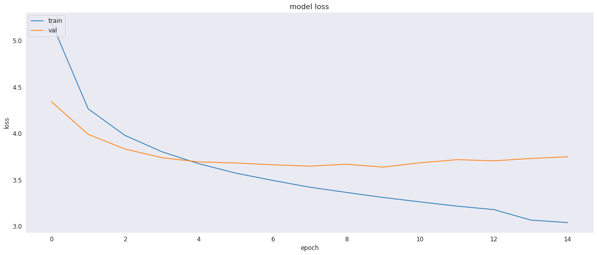
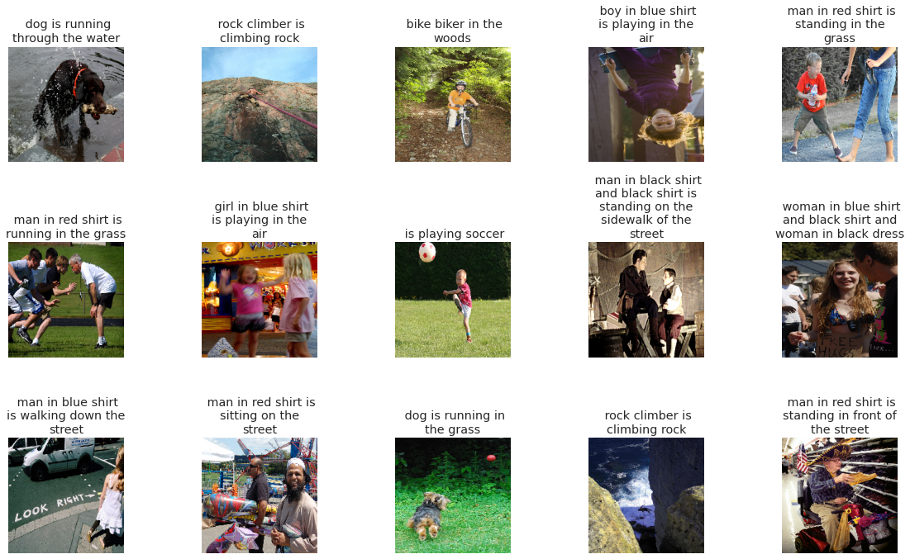

## DenseNet201 For Feature Extraction
This code defines a feature extraction model using the pre-trained DenseNet201 architecture, and uses it to extract features from a set of images. The extracted features are stored in a dictionary with the image names as keys.

Specifically, the code first creates a DenseNet201 model using the Keras library. The next line of code creates a new model fe that takes the input and output from the original DenseNet201 model, but stops at the second-to-last layer. This new model will output the features extracted by the DenseNet201 model, rather than the final classification predictions.

Next, the code sets the desired image size for preprocessing to 224x224 pixels. The code then creates an empty dictionary called features to store the extracted features.

The code then loops over each unique image in the data['image'] column. For each image, the code loads the image using the load_img function from the Keras preprocessing library, resizes it to the desired size, converts it to a NumPy array, and normalizes it by dividing by 255. The np.expand_dims function is used to add an extra dimension to the array, so that it has shape (1, img_size, img_size, 3) which is the input shape expected by the DenseNet201 model.

The next line of code uses the feature extraction model fe to extract the features from the preprocessed image. The extracted features are stored in the features dictionary with the image name as the key.

## Model Description
This code defines and compiles a neural network model for image captioning using Keras with TensorFlow backend. The model is a variation of the encoder-decoder architecture, where the image features are extracted using a pre-trained CNN and the text features are generated using an LSTM network.

The first two lines define the input layers for the model. input1 is an input layer for the image features, and input2 is an input layer for the text features.

The next line defines a dense layer with 256 units and ReLU activation, which processes the image features input. The output from this layer is reshaped to have dimensions (1, 256) using the Reshape layer.

The Embedding layer is used to process the text features input. It takes the vocabulary size, which is the number of unique words in the training dataset, and a word embedding dimension of 256 as its arguments.

The concatenate function is used to combine the reshaped image features and the processed text features along the first dimension, resulting in a tensor with dimensions (batch_size, max_length+1, 256).

The LSTM layer is used to generate the text features from the combined image and text features. It has 256 units and takes the combined tensor as its input.

The next line applies dropout regularization with a rate of 0.5 to the LSTM output.

The add function is used to add the original image features to the LSTM output, before applying another dense layer with 128 units and ReLU activation.

Another dropout layer is applied with a rate of 0.5, before the final output layer with softmax activation is added to generate the probability distribution over the vocabulary of words.

The model is compiled using categorical cross-entropy loss and the Adam optimizer.

The remaining code defines several callbacks, including the ModelCheckpoint, EarlyStopping, and ReduceLROnPlateau callbacks, which are used to save the best model weights, stop training early if the validation loss does not improve, and reduce the learning rate if the validation loss plateaus, respectively.

```
__________________________________________________________________________________________________
 Layer (type)                   Output Shape         Param #     Connected to                     
==================================================================================================
 input_2 (InputLayer)           [(None, 1920)]       0           []                               
                                                                                                  
 dense (Dense)                  (None, 256)          491776      ['input_2[0][0]']                
                                                                                                  
 input_3 (InputLayer)           [(None, 33)]         0           []                               
                                                                                                  
 reshape (Reshape)              (None, 1, 256)       0           ['dense[0][0]']                  
                                                                                                  
 embedding (Embedding)          (None, 33, 256)      2171904     ['input_3[0][0]']                
                                                                                                  
 concatenate (Concatenate)      (None, 34, 256)      0           ['reshape[0][0]',                
                                                                  'embedding[0][0]']              
                                                                                                  
 lstm (LSTM)                    (None, 256)          525312      ['concatenate[0][0]']            
                                                                                                  
 dropout (Dropout)              (None, 256)          0           ['lstm[0][0]']                   
                                                                                                  
 add (Add)                      (None, 256)          0           ['dropout[0][0]',                
                                                                  'dense[0][0]']                  
                                                                                                  
 dense_1 (Dense)                (None, 128)          32896       ['add[0][0]']                    
...
Total params: 4,316,324
Trainable params: 4,316,324
Non-trainable params: 0
__________________________________________________________________________________________________
```

## Results

## Model Loss Plots
This is a training log for an image captioning model. The model was trained for 50 epochs, with the training loss decreasing and the validation loss improving until epoch 10. However, after epoch 10, the validation loss stopped improving, so the model weights from the best epoch were restored. The model was then trained for 5 more epochs with a smaller learning rate, but the validation loss did not improve, so early stopping was applied. The final model was saved at the end of epoch 10.


## Tags Generated

